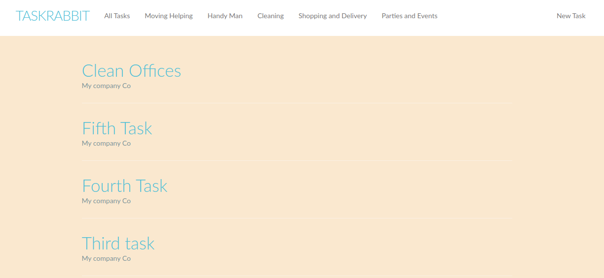
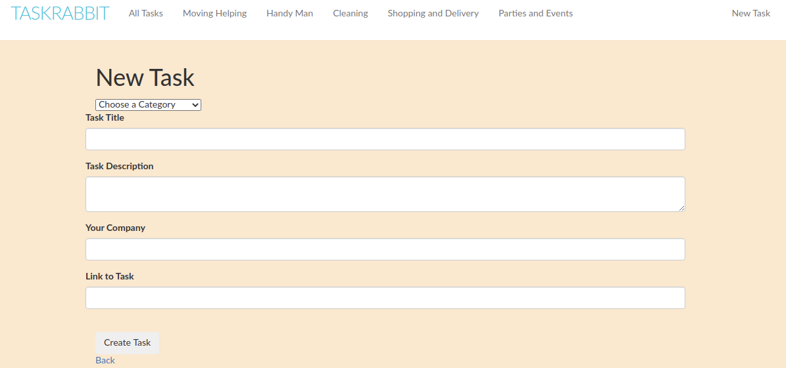

# TaskRabbit Lookalike
A project to create, update and delete tasks, sort them by their categories 

## Screenshot




## Contribution guide

1. Clone the project
```bash
  git clone https://github.com/Mesi21/TaskRabbit_Lookalike
  cd TaskRabbit_Lookalike
  install the gems by running: `$ bundle install`
  update the bundle: `$ bundle update`
  start the server `rails s`
  open browser: `localhost:3000`
```

2. Then :heavy_plus_sign: add your contribution
3. And Feel free to make a PR

## Tehnical tools:

- Rails
- Ruby

### Gems

- simpe_form
- bootstrap-sass

## Contributors

- Emese Molnar [@Mesi21](https://github.com/Mesi21)

### If you like this project don't forget to support it by giving a :star: 